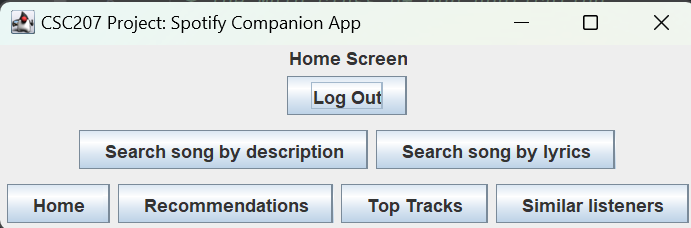
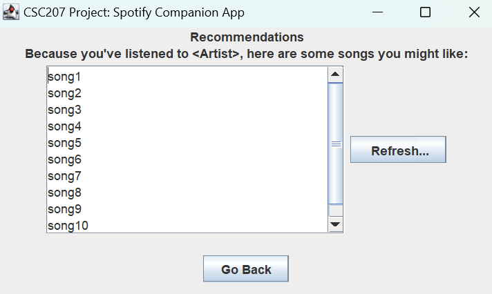
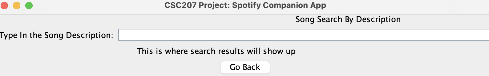
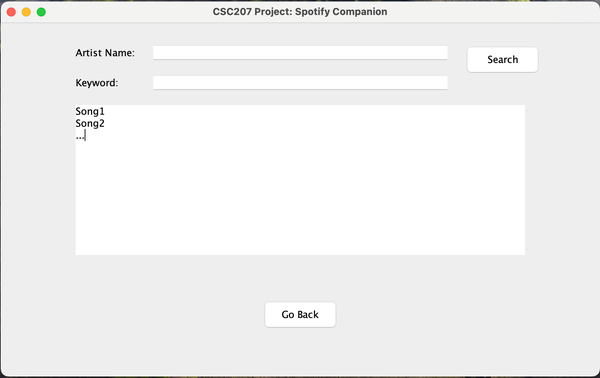
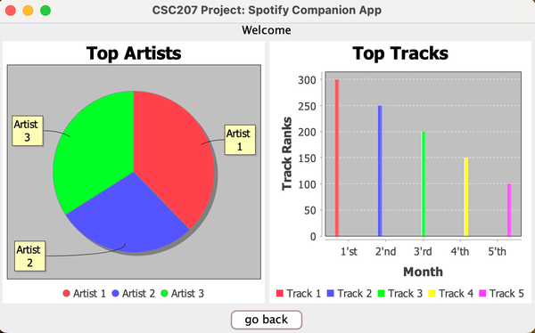
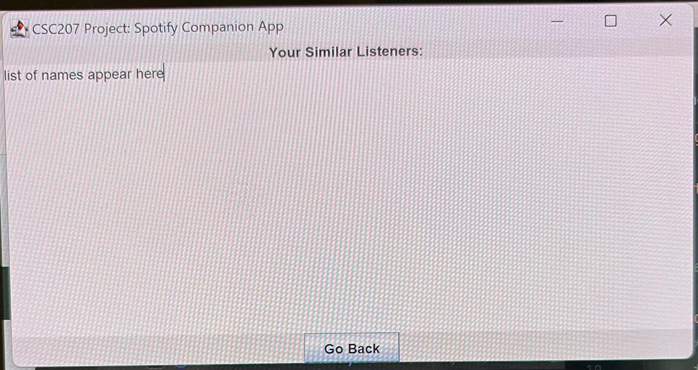

# CSC 207 Project: Spotify Companion

## Software Description
The software is made through Java Swing and acts as an extension of a user’s Spotify account. 
The program visualizes user listening patterns, 
suggests new or related songs for their preferences, search songs by certain 
lyrics and keywords that the user gives, and can find users with similar preferences. 
It is going to be a general extension to the overall Spotify experience.
 
 
The APIs we will use are Spotify (to access user data) and Azure OpenAI (to interpret data and recommend songs)

## Authors
Yanki Cer -> yankicer  
Dimitrios Gkiokmema -> DimitriosGkiokmema  
Quinn Reynolds -> Reyno256  
Ksenia Tkaczyk -> KseniaTk  
Yicheng (Ethan) Wang -> eulogizee

## Table of Contents
1. [Features](#Features)
2. [Installation Instructions](#Installation)
3. [Usage](#Usage)
4. [Feedback and Contributions](#Feedback)

## Features
There are six major features of the app; one for each of us to work on independently, and one to collaborate on as a team. Below is an image of the overall pages which a user can access. Below each feature is an image of the associated view in the software.
### Login Screen  
* Sign In/Out: The first is a user signing in and signing out(Team).

  
  

* Recommendations: The app can also get song recommendations based on a user's music preferences using the for you button. (Dimitrios)
  
*   Search by Description: The user can enter the description of a song and have its title returned. (Quinn)

  

* Search by Artist and Lyric: A user may want to see some songs based on a given keyword. They can enter the keyword into a search text box and get 
suggestions. (Ethan)
  

* Top Tracks: A user wants to see what their most listened to tracks are. (Yanki)
  

* Similar Music: A user wants to find other individuals that have a similar music preference. (Ksenia)

  

## Installation
As this app is written entirely in Java it runs well on a variety of devices. 
Currently, it has been tested on Windows 11, macOS 14 and Ubuntu 24, although likely
many other operating systems would also work. 
1. After installing the Java files the user must ensure all the Maven dependencies are properly installed. In IntelliJ IDEA this can be done by clicking on the m on the right side of the screen and clicking reload all maven projects incrementally as seen below.
2. The other packages which Maven will download are Okhttp(https://square.github.io/okhttp/) version 4.12.0, JFreeChart(https://www.jfree.org/jfreechart/) version 1.5.4 and Azure openAI(https://learn.microsoft.com/en-us/java/api/overview/azure/ai-openai-readme?view=azure-java-preview) beta version 12.
3. To log in to the app you are required to have a spotify app access token. Getting this token is clearly explained in this link(https://developer.spotify.com/documentation/web-api/tutorials/getting-started), as well as below.
   1. In the spotify app go to your Dashboard, click on the Create an app button and enter the following information: App Name: My App
   App Description: This is my first Spotify app
   Redirect URI: You won't need this parameter in this example, so let's use http://localhost:3000.
   2. Check the Developer Terms of Service checkbox and tap on the Create button.
   3. Click on the name of the app you have just created (My App)
   4. Click on the Settings button
   5. The Client ID can be found here, it is essential for the next part of the process so record it somewhere safe. The Client Secret can be found behind the View client secret link this is also required for the next step.
   6. To request an access token navigate to https://hoppscotch.io/ and Send a POST request to the token endpoint URI.
   7. Add the Content-Type header set to the application/x-www-form-urlencoded value.
   8. Add an HTTP body containing the Client ID and Client Secret, along with the grant_type parameter set to client_credentials.
   9. The response will be a spotify access token which is valid for 1 hour and can be used to log in to the app.
4. In order to access the other API used in this project you must add a file called keys(with no file type extension) to the src directory of the project.
5. Then you must paste in the Azure openAI api key used for the project, if you don't have this key, and you need access to it email quinn.reynolds@mail.utoronto.ca.
6. After these steps the app should work for you, keep in mind you will need to regenerate a Spotify API key every hour. 

## Usage

## Feedback
This code was written for CSC207 in the fall of 2024 and if you are reading 
this document after that point then the code will no longer be maintained. 
If you would like access to this repository please email dimitrios.gkiokmema@mail.utoronto.ca. As this is a public project please be civil and send all emails related to the project with the subject line "Spotify Companion <your GitHub username>". You can expect a response within 5 days in general.
In terms of contribution, any pull requests which include changes to Interactor files must also 
include updated tests for those files. It is expected that all code written for this project follow 
the ACCEU framework for code documentation and commenting. Code reviews will be conducted by the 
orignial authors of the repository based on adherence to the principles of Clean Architecture and SOLID principles of software design.
